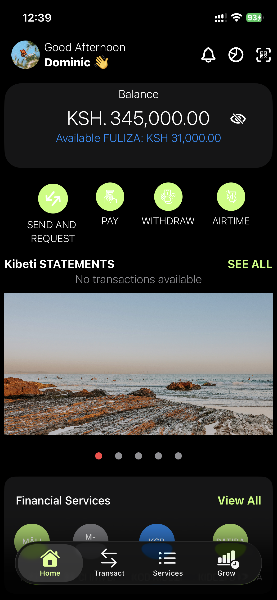
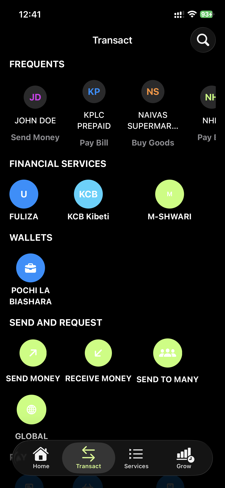
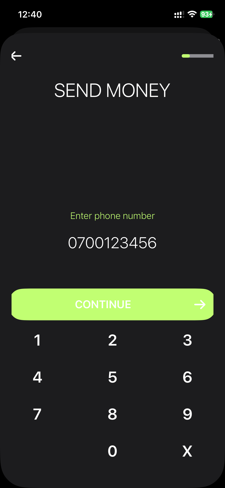
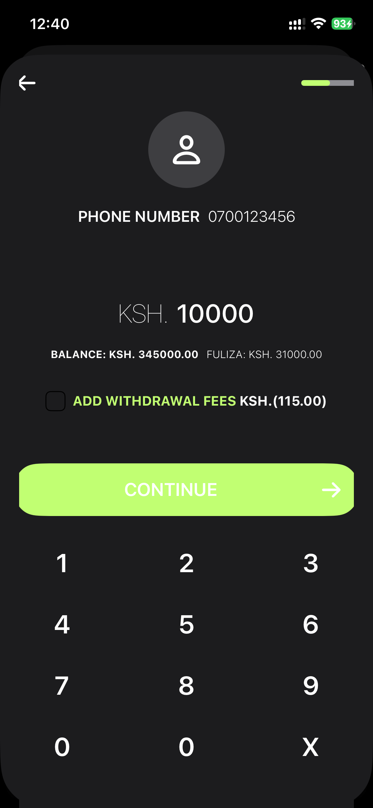
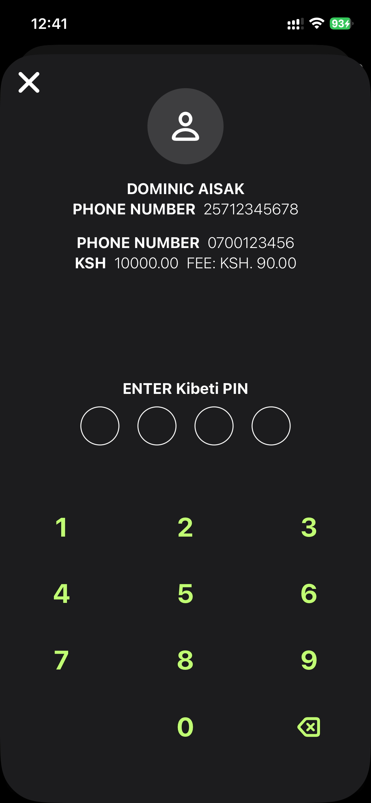
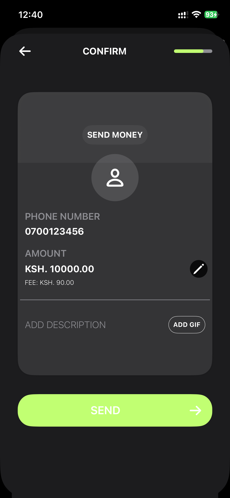
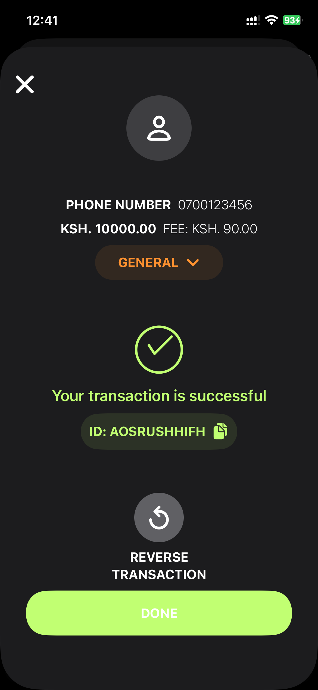
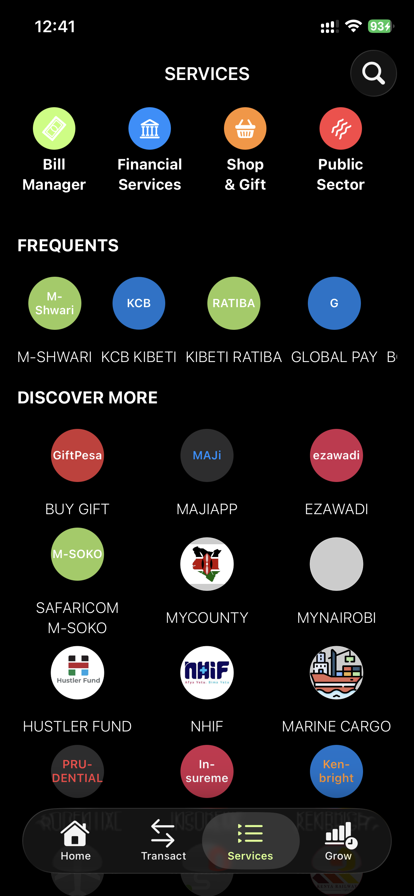
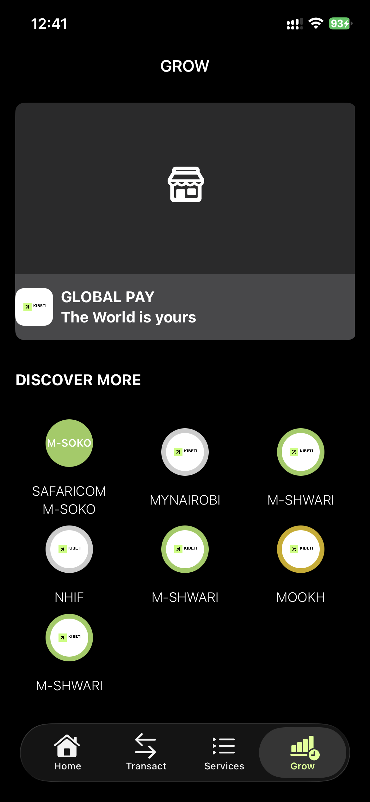

# Kibeti


**Kibeti** is a sophisticated mobile financial application built with SwiftUI, designed as a comprehensive clone of the Safaricom M-PESA App. It showcases advanced fintech features including money transfers, bill payments, savings management, and global payments, all wrapped in a modern, user-centric interface.

## 📱 Features

- **Home Screen**: A personalized dashboard showing account balances and frequent actions.
- **Send & Request Money**: A seamless, multi-step process for sending money to mobile numbers or bank accounts.
- **Transact**: Access to Pay Bill, Buy Goods, and Pochi La Biashara services.
- **Services**: A dedicated marketplace for various digital and financial services.
- **Grow**: Comprehensive management of M-Shwari savings and loans.
- **Global Pay**: Virtual card management for international payments.
- **Authentication**: Secure access using Biometric (Face ID/Touch ID) and PIN-based authentication.
- **Notifications**: Real-time alerts for transaction status and account activity.

## 🎨 Branding

Kibeti features a unique identity with:
- **Primary Color**: `#C1FF72` (Kibeti Green) for a fresh, modern financial feel.
- **Custom UI Components**: Built from scratch to ensure a high-quality, native experience.

## 📸 Screenshots

### Home & Navigation
<p align="center">
  
  
  
</p>

### The Sending Money Process
Experience the fluid, multi-step transaction flow:
<p align="center">
  
  
  
  
  
</p>

### Services & Growth
<p align="center">
  
  
  
</p>

## 🛠 Tech Stack

- **Language**: Swift 5.10+
- **Framework**: SwiftUI
- **Architecture**: MVVM (Model-View-ViewModel)
- **Backend**: Firebase (Auth, Firestore, Cloud Messaging)
- **Security**: LocalAuthentication (Biometrics)
- **Local Storage**: UserDefaults & Keychain

## 🚀 Getting Started

1. Clone the repository:
   ```bash
   git clone https://github.com/sirbor/Kibeti.git
   ```
2. Open `Kibeti.xcodeproj` in Xcode.
3. Ensure you have a valid `GoogleService-Info.plist` for Firebase integration.
4. Build and run on a simulator or physical iOS device.

---

**Developed by Dominic Bor**
*April 4, 2026*
